# 安久銀行 HR 知識圖譜 — 範例子圖(請假 / 特休 / 加班 / 補休)

由實際資料建出的完整圖為 **172 節點 / 239 邊**;下圖是其中「請假與加班」概念樞紐的 1-hop 子圖。

- 🟦 概念 concept　🟧 勞基法條 law_article　🟩 內規條文 internal_policy_article
- 實線箭頭上的字是 relation;`supplements` 代表內規補充/優於該法條。

```mermaid
graph TD
    concept_special_leave["特別休假"]
    concept_comp_time["補休"]
    concept_leave["請假制度"]
    concept_overtime["加班與延長工時"]
    law_38["第 38 條"]
    policy_11["第 11 條 特別休假"]
    policy_12["第 12 條 特別休假未休日數處理"]
    policy_23["第 23 條 補休申請原則"]
    policy_24["第 24 條 補休時數計算"]
    policy_25["第 25 條 補休期限"]
    policy_26["第 26 條 契約終止或期限屆滿未補休"]
    policy_27["第 27 條 補休與業務安排"]
    concept_hr_policy["HR 規章制度"]
    concept_sick_leave["病假"]
    concept_personal_leave["事假"]
    concept_family_care_leave["家庭照顧與緊急照顧"]
    concept_statutory_leave["其他法定假別"]
    concept_leave_dispute["請假爭議"]
    law_43["第 43 條"]
    policy_10["第 10 條 請假申請原則"]
    policy_17["第 17 條 請假爭議處理"]
    concept_overtime_pay["加班費"]
    concept_overtime_limit["延長工時限制"]
    concept_unreported_overtime["未申報加班爭議"]
    concept_hr_policy -->|parent_of / child_of| concept_leave
    concept_hr_policy -->|parent_of / child_of| concept_overtime
    concept_leave -->|parent_of / child_of| concept_special_leave
    concept_leave -->|parent_of / child_of| concept_sick_leave
    concept_leave -->|parent_of / child_of| concept_personal_leave
    concept_leave -->|parent_of / child_of| concept_family_care_leave
    concept_leave -->|parent_of / child_of| concept_statutory_leave
    concept_leave -->|parent_of / child_of| concept_leave_dispute
    concept_leave -->|has_rule / related_to| law_38
    concept_leave -->|has_rule / related_to| law_43
    concept_leave -->|has_rule / related_to| policy_10
    concept_leave -->|has_rule / related_to| policy_17
    concept_special_leave -->|has_rule / related_to| law_38
    concept_special_leave -->|has_rule / related_to| policy_11
    concept_special_leave -->|has_rule / related_to| policy_12
    concept_sick_leave -->|has_rule / related_to| law_43
    concept_personal_leave -->|has_rule / related_to| law_43
    concept_statutory_leave -->|has_rule / related_to| law_43
    concept_leave_dispute -->|has_rule / related_to| law_43
    concept_leave_dispute -->|has_rule / requires_review| policy_17
    concept_overtime -->|parent_of / child_of| concept_overtime_pay
    concept_overtime -->|parent_of / child_of| concept_overtime_limit
    concept_overtime -->|parent_of / child_of| concept_unreported_overtime
    concept_overtime -->|parent_of / child_of| concept_comp_time
    concept_comp_time -->|has_rule / supplements| policy_23
    concept_comp_time -->|has_rule / related_to| policy_24
    concept_comp_time -->|has_rule / supplements| policy_25
    concept_comp_time -->|has_rule / related_to| policy_26
    concept_comp_time -->|has_rule / related_to| policy_27
    policy_11 -->|overrides| law_38
    policy_12 -->|supplements| law_38
    policy_17 -->|refers_to| law_43
    classDef concept fill:#e7f0ff,stroke:#3366cc,stroke-width:2px;
    class concept_special_leave,concept_comp_time,concept_leave,concept_overtime,concept_hr_policy,concept_sick_leave,concept_personal_leave,concept_family_care_leave,concept_statutory_leave,concept_leave_dispute,concept_overtime_pay,concept_overtime_limit,concept_unreported_overtime concept;
    classDef law_article fill:#fff3e0,stroke:#e8920b;
    class law_38,law_43 law_article;
    classDef internal_policy_article fill:#e8f5e9,stroke:#2e7d32;
    class policy_11,policy_12,policy_23,policy_24,policy_25,policy_26,policy_27,policy_10,policy_17 internal_policy_article;
```

